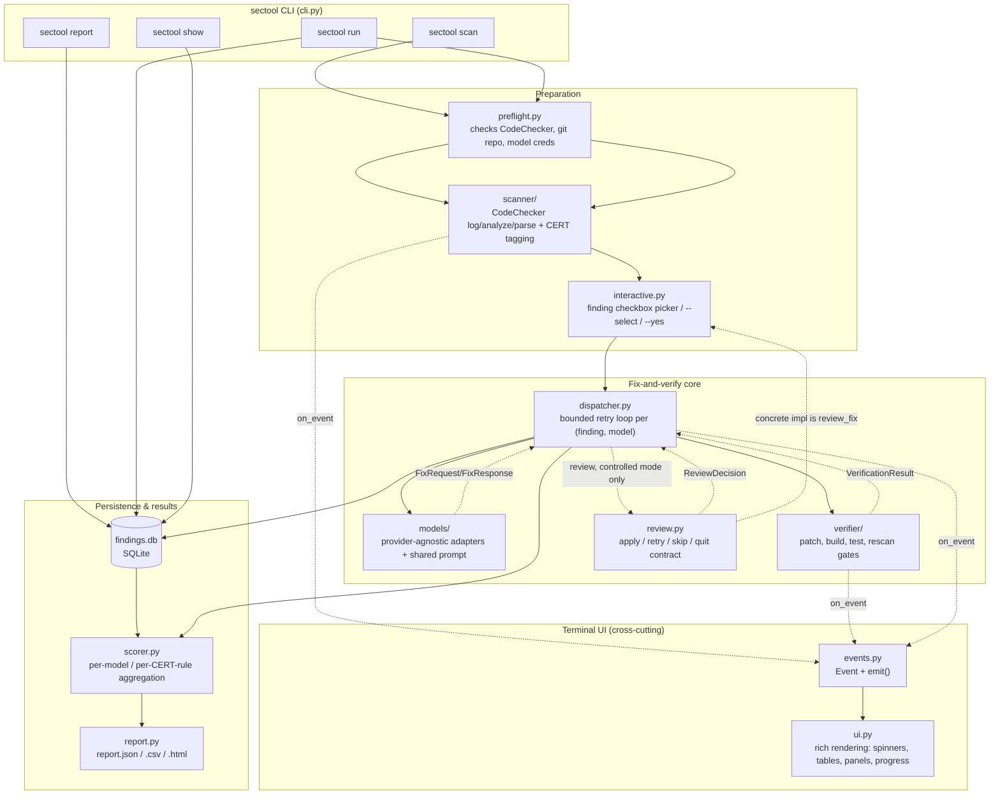
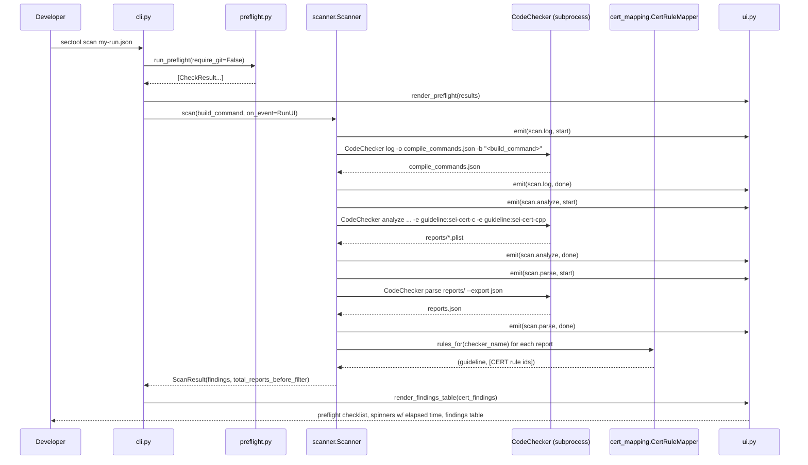
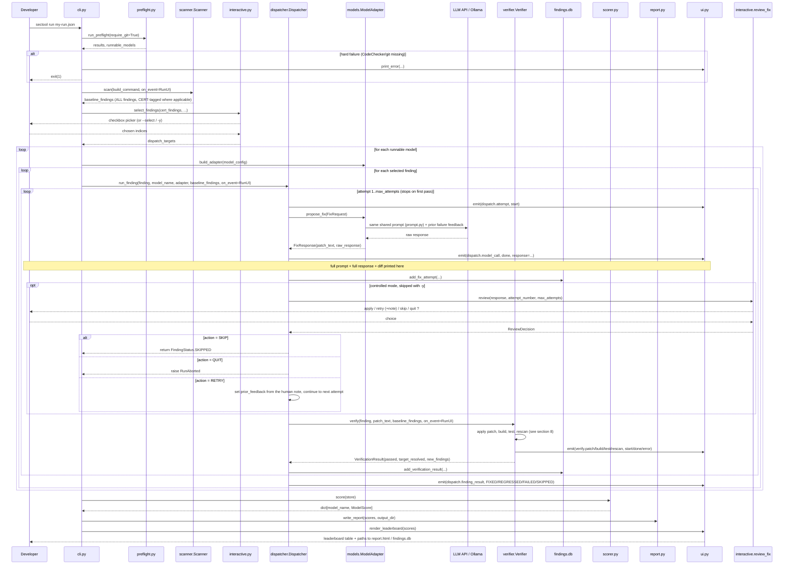
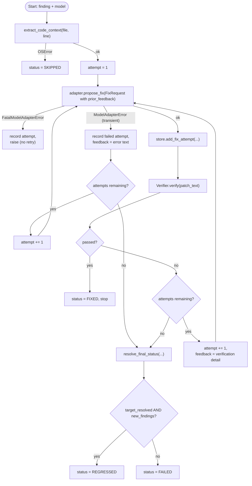
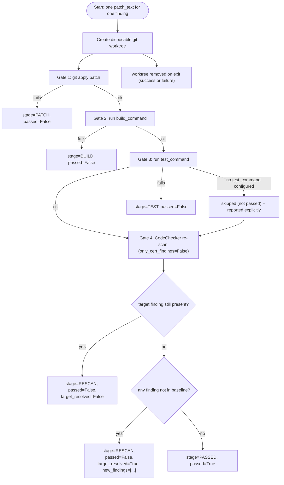
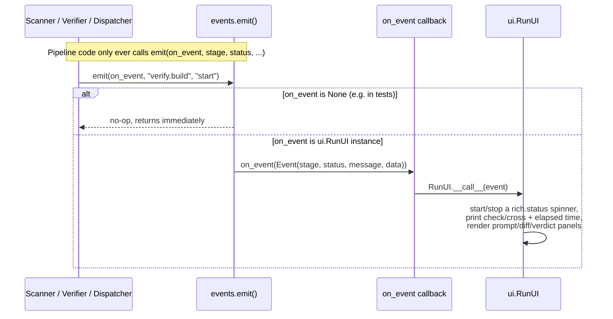
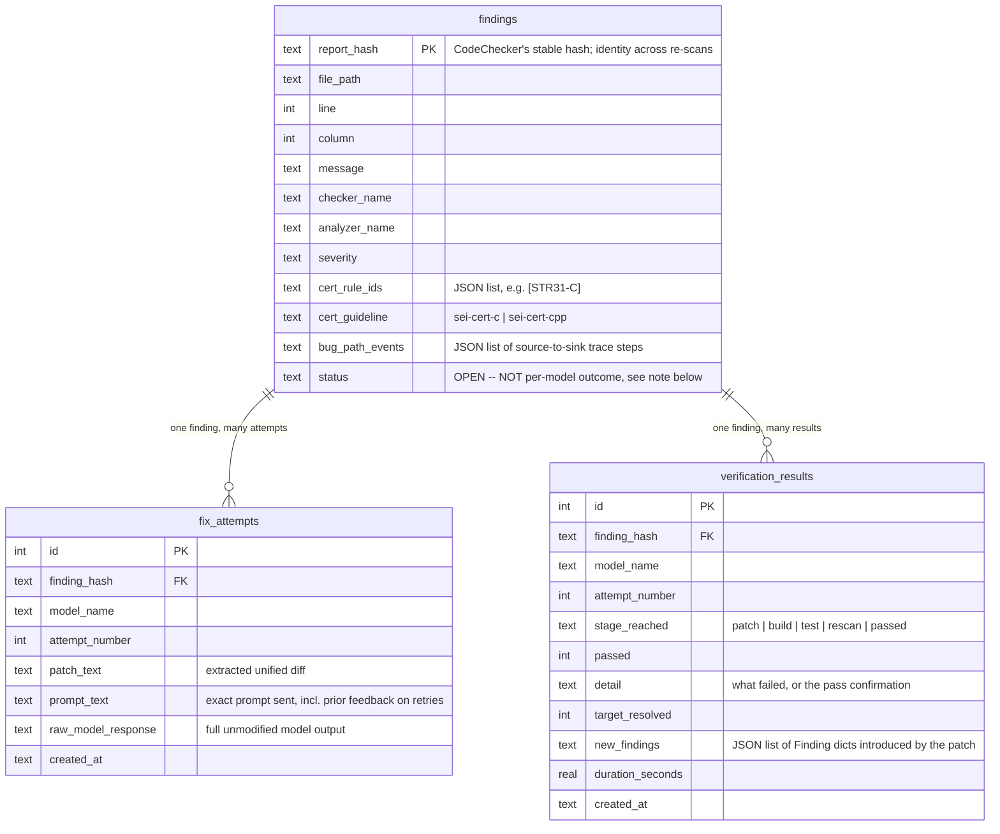
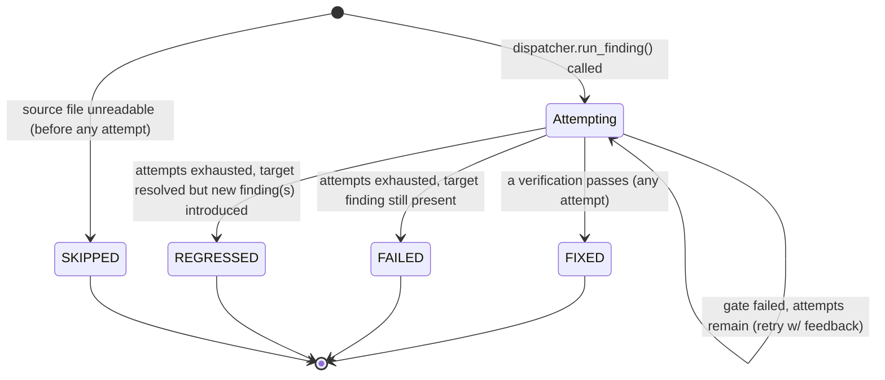

# sectool Architecture

This document explains **how the tool actually works**: what runs where,
what talks to what, and in what order. `PLAN.md` covers the original
design rationale and phased rollout; `README.md` is the quick-start; this
document is the deep technical reference.

## 1. What it does, in one paragraph

`sectool` scans a C/C++ project with **CodeChecker**, selects findings using
configured **CWE benchmark**, **SEI CERT**, and checker-name filters, sends each
one to one or more **LLMs** asking for a minimal patch, and only accepts a
patch once it has cleared four independent gates (applies cleanly, builds,
passes the project's existing tests, and a CodeChecker re-scan shows the
finding gone with nothing new introduced). Every attempt -- prompt, raw
model response, extracted diff, and gate-by-gate result -- is written to a
SQLite database as it happens, and a Scorer/Report step turns that into a
per-model, per-CWE/CERT-rule comparison. A terminal UI layer (`rich` +
`questionary`) surfaces every step live so a developer never has to guess
what the tool is doing.

## 2. Tech stack & versions

Versions below are what this project was built and verified against
(`Ubuntu 26.04 LTS`). Newer patch versions of any of these should work
unmodified; if a *major* version of CodeChecker changes its CLI/JSON
output shape, see §14 for what would need re-verifying.

| Layer | Tool / library | Version verified against | Role |
|---|---|---|---|
| Language runtime | Python | 3.14.4 (requires `>=3.10`) | Everything in `sectool/` |
| Static analysis orchestrator | [CodeChecker](https://github.com/Ericsson/codechecker) | 6.28.2 | Runs analyzers, produces findings |
| Underlying analyzer | clang-tidy (LLVM) | 21.1.8 | Supplies the `cert-*` / `bugprone-*` / etc. checkers, including the `sei-cert-c` / `sei-cert-cpp` checker-label guidelines |
| Underlying analyzer | cppcheck | 2.19.0 | Additional C/C++ static analysis checkers CodeChecker orchestrates |
| Version control | git | 2.53.0 | Source of truth for the project under test; each patch attempt runs in a disposable `git worktree` |
| Persistence | SQLite (stdlib `sqlite3`) | 3.46.1 | `findings.db` -- the only stateful artifact of a run besides the report files |
| CLI framework | [click](https://click.palletsprojects.com/) | 8.4.2 | `sectool` command group/subcommands |
| Terminal UI | [rich](https://github.com/Textualize/rich) | 15.0.0 | Spinners, progress bars, tables, syntax-highlighted diffs, panels |
| Interactive prompts | [questionary](https://github.com/tmbo/questionary) | 2.1.1 | The findings checkbox picker |
| LLM SDK | [anthropic](https://github.com/anthropics/anthropic-sdk-python) | 0.116.0 | Claude models |
| LLM SDK | [openai](https://github.com/openai/openai-python) | 2.45.0 | GPT models |
| LLM transport | [requests](https://requests.readthedocs.io/) | 2.34.2 | Ollama's local HTTP API (no official SDK needed) |
| Report templating | [Jinja2](https://jinja.palletsprojects.com/) | 3.1.6 | `report.html` |
| Tests | pytest | 9.1.1 | 63 offline tests, no CodeChecker/API keys/network required |

## 3. High-level architecture



Key structural point: **the pipeline modules (`scanner`, `verifier`,
`dispatcher`) never import `rich` or `questionary`.** They only call
`sectool.events.emit(on_event, ...)`, which is a no-op when `on_event` is
`None` -- exactly the case in every unit test. `cli.py` is the only place
that wires a real `ui.RunUI` instance in as `on_event`, so the terminal
experience is entirely swappable (e.g. a JSON-lines log renderer for CI)
without touching pipeline logic.

### 3.1 Analyzer evidence versus benchmark ground truth

These inputs are intentionally separate. `checker_name`, message, location,
and bug-path events are analyzer evidence. `cwe_ids` and `cwe_name` are dataset
metadata derived from Juliet-style path segments when `cwe_from_filename` is
enabled. CERT IDs come from CodeChecker checker labels. The prompt shows all
three without claiming that one was derived from another.

`dispatch_filter` chooses `cert`, `cwe`, or `all`. `include_checkers` and
`exclude_checkers` are applied afterward. This second filter is required for
benchmark corpora because a source tree can produce thousands of incidental
diagnostics unrelated to its labeled weakness. Initial scan and verification
re-scan receive the identical `checker_enables` set.

Each run writes `run-manifest.json` with prompt/tool versions, project git
identity, model request parameters, scan policy, and exact selected findings.
Pre-verification model-output failures are persisted in the database; provider
and configuration failures are categorized as infrastructure and excluded from
the model-capability denominator.

## 4. CLI commands: what each one triggers

| Command | Triggers (in order) | Model calls? | Git worktree needed? |
|---|---|---|---|
| `sectool scan <config>` | `preflight.run_preflight(require_git=False)` -> `scanner.Scanner.scan()` -> print findings table | No | No |
| `sectool run <config>` | `run_preflight(require_git=True)` -> `Scanner.scan()` -> `interactive.select_findings()` -> `Dispatcher.run_finding()` per (finding, model), pausing for `interactive.review_fix()` after each model response unless `-y` -> `scorer.score()` -> `report.write_report()` | Yes | Yes (one per patch attempt) |
| `sectool report <db> -o <dir>` | `FindingStore` read -> `scorer.score()` -> `report.write_report()` | No | No |
| `sectool show <db> <hash>` | `FindingStore` read -> print stored prompt/response/patch/verdict | No | No |

`sectool run`'s default mode is **controlled**: findings are picked via an
interactive checkbox, and every model response is reviewed by a human
before it's ever applied or verified (see §7.2). Pass `-y`/`--yes` for the
fully **automated** mode instead (dispatches every matched finding,
respecting `finding_limit`, and applies/verifies every response
immediately) -- this is the mode to use for CI or unattended runs.

## 5. Sequence: `sectool scan`



## 6. Sequence: `sectool run` (end-to-end)



## 7. Retry loop detail (`Dispatcher.run_finding`, one finding x one model)



`resolve_final_status()` (in `dispatcher.py`) is the single place this
FIXED / REGRESSED / FAILED decision is made -- the Scorer re-derives the
exact same mapping when reading results back out of `findings.db`, so the
live terminal verdict and the final leaderboard can never disagree.

### 7.1 Fatal vs transient model errors

Not every model call failure is worth retrying. `models/base.py` defines
two exception types:

- **`ModelAdapterError`** -- transient: a rate limit that may clear, a
  momentary server error, a network blip. The retry loop above treats it
  like a failed verification gate: consume one attempt, feed the error
  back to the model, try again.
- **`FatalModelAdapterError`** -- will fail identically on every retry,
  because the problem is with the *model/account*, not this particular
  finding: an invalid/expired API key, no permission for the model, the
  model doesn't exist, or the account has no quota/credit left. Each
  adapter classifies its SDK's exceptions into one of these two using the
  provider's own structured error fields, not string-matching:

  | Provider | Fatal when | Transient when |
  |---|---|---|
  | Anthropic | `AuthenticationError`, `PermissionDeniedError`, `NotFoundError`; or any `APIStatusError` with `.type == "billing_error"` | `.type == "rate_limit_error"` or `"overloaded_error"` |
  | OpenAI | `AuthenticationError`, `PermissionDeniedError`, `NotFoundError`; or any `APIError` with `.code == "insufficient_quota"` | `.code == "rate_limit_exceeded"`, `InternalServerError`, timeouts |
  | Ollama | connection refused (server down), HTTP 404 (model not pulled) | request timeout |

  `Dispatcher.run_finding` re-raises a `FatalModelAdapterError` immediately
  instead of consuming a retry (see the `Fatal` node above). `cli.py`'s
  dispatch loop catches it at the per-model level: it prints the reason,
  marks every *remaining* finding for that model as skipped (fast, no
  further calls), and continues on to the next model -- so one exhausted
  API quota aborts that model's remaining work in roughly one call instead
  of `max_attempts x remaining_findings` doomed calls. Both SDK clients are
  also constructed with `max_retries=1` so the SDK's own internal
  retry-on-429 doesn't compound with this application-level retry loop.

### 7.2 Controlled vs automated: the review gate

By default, `sectool run` in a terminal (i.e. not `-y`, and stdout is a
TTY) pauses **after every model response, before it is ever applied to a
worktree or spends any build/test time**. `ui.RunUI` has already printed
the full prompt, the full raw response, and the extracted diff (via the
`dispatch.model_call` event); `interactive.review_fix` then asks:

| Choice | What happens |
|---|---|
| **Apply and verify** | Proceeds exactly as the fully-automated loop always has: patch the worktree, run the four gates. |
| **Retry** | The response is discarded without ever being verified. You're asked for an optional free-text note; the next attempt's prompt includes it (`"A human reviewer asked for changes instead of accepting this patch: <note>"`) in place of a verifier failure. Still counts against `max_attempts_per_finding`. |
| **Skip** | Stops working this finding for this model. Recorded as `FindingStatus.SKIPPED`, same as an unreadable source file. |
| **Quit** | Raises `dispatcher.RunAborted`, caught by `cli.py`'s dispatch loop: no further findings or models are dispatched, but everything completed *before* the quit is still scored and reported -- quitting stops future work, it never discards past results. |

Pass `-y`/`--yes` to skip this (and the interactive finding-selection
picker) for CI/non-interactive runs -- the loop then behaves exactly as
described in §7's diagram, with every response auto-applied.

This is implemented as an injected callback
(`sectool.review.ReviewCallback`), not a hardcoded terminal interaction:
`Dispatcher.run_finding()` only knows about the `ReviewAction` enum, not
about `questionary` or any terminal at all, so the retry loop's control
flow is unit-testable with a scripted callback (see
`tests/test_dispatcher.py`) independently of the terminal UI.

## 8. Verification gates: exactly what "fixed" means

This section is the precise reference for **how a patch is judged**, gate
by gate, since that judgment is the entire point of the tool -- a model's
fix rate is only meaningful if "fixed" means something concrete and
consistent.



Gates run in order and **short-circuit on first failure**: if Gate 1
fails, Gates 2-4 never run for that attempt. This is deliberate, not just
an optimization -- it means the feedback threaded back into the next
model attempt (`result.detail`, or the human reviewer's own note in
controlled mode) is always the *earliest, most actionable* problem, never
a confusing pile of downstream symptoms from a build that never even
succeeded. A patch is recorded as `FindingStatus.FIXED` **only** if it
clears all four gates in a single attempt -- there is no partial credit
and no gate is ever skipped as "probably fine."

### Gate 1 -- Patch application (`verifier/patch.py`)

- **Mechanism**: the model's extracted diff is written to a temp file and
  applied with `git apply --whitespace=fix` inside the disposable
  worktree.
- **Pass**: `git apply` exits 0.
- **Fail**: `git apply` exits non-zero (a hunk doesn't match the file's
  current content -- e.g. the model hallucinated line numbers/context, or
  edited a region a previous attempt already changed), **or** the model's
  response contained no diff at all (`patch_text` is empty after
  extraction -- see `ModelAdapter.extract_diff`'s fallback behavior in
  `models/base.py`).
- **Recorded as**: `stage_reached = PATCH`, `passed = False`,
  `target_resolved = False` (default; not applicable at this stage).
- **What the model sees on retry**: git's own stderr, naming the specific
  hunk that failed and why.

### Gate 2 -- Build (`verifier/build.py::run_build`)

- **Mechanism**: `project.build_command` is run via the shell
  (`subprocess.run(..., shell=True)`) inside the worktree, with a timeout
  (`Verifier.build_timeout`, default 900s).
- **Pass**: exit code 0.
- **Fail**: non-zero exit code, **or** the command times out.
- **Recorded as**: `stage_reached = BUILD`, `passed = False`.
- **What the model sees on retry**: the last 100 lines of combined
  stdout+stderr (`verifier/build.py::_tail`) -- capped because compiler
  output on a full rebuild can be enormous, and the actual error is almost
  always at the end.
- **Known sharp edge**: `build_command` must be a genuinely *clean*
  build every time it runs (this project's own build re-runs the same
  command against a fresh worktree each attempt, so an incremental build
  tool that thinks there's "nothing to do" will build nothing and this
  gate will falsely pass -- see `docs/SETUP.md`'s incremental-build
  warning). This is a property of how `build_command` is written, not
  something the Verifier can detect.

### Gate 3 -- Tests (`verifier/build.py::run_tests`)

- **Mechanism**: `project.test_command` is run the same way as the build,
  with its own timeout (`Verifier.test_timeout`, default 900s).
- **Pass**: exit code 0, **or** `test_command` is empty.
- **Fail**: non-zero exit code, or timeout.
- **Explicitly not conflated with pass**: an empty `test_command` is
  recorded as *skipped*, not passed -- `CommandResult.skipped = True` is a
  distinct field from `ok`, and `ui.py` prints it as a dim informational
  line, never a green checkmark. A project with no test suite therefore
  never gets a false sense of security from this gate; its trust burden
  shifts entirely onto Gate 4.
- **Recorded as**: `stage_reached = TEST`, `passed = False` (failure) --
  a skip does not set `stage_reached = TEST` with `passed=False`, it lets
  execution continue to Gate 4 (skips are not failures).

### Gate 4 -- CodeChecker re-scan (`verifier/verifier.py`, using `scanner/codechecker.py`)

This is the gate that actually judges *security*, not just "does it
compile" -- and it is the most nuanced, so its exact logic is spelled out
in full:

1. The Verifier re-runs the **entire** scan pipeline (`Scanner.scan()`,
   the same log -> analyze -> parse sequence as the initial scan) against
   the patched worktree, with `only_cert_findings=False` (unlike the
   initial dispatch scan, this keeps *every* CodeChecker finding, not just
   SEI CERT ones -- a regression outside the configured guidelines still
   counts as a regression).
2. Every finding -- before and after -- is identified by CodeChecker's own
   `report_hash`: a hash CodeChecker computes from the checker name, the
   finding's location, and surrounding code context (see CodeChecker's own
   `report_identification` design). Two scans producing the same
   `report_hash` for a finding are treated as *the same finding*; this
   tool does not re-derive or second-guess that hash.
3. **`target_resolved`** = the original finding's `report_hash` is **not**
   present in the post-patch scan's finding set.
   - If it's still present: `passed = False`, `target_resolved = False`,
     regardless of anything else -- the patch didn't fix the problem (or
     fixed a different location that happens to share context, which is
     rare given how the hash is computed).
4. **`new_findings`** = every finding in the post-patch scan whose
   `report_hash` was **not** in the pre-patch baseline scan
   (`baseline_findings`, captured once at the very start of `sectool run`,
   before any model touches anything).
   - If `target_resolved` is True but `new_findings` is non-empty:
     `passed = False` still -- this is the **regression** case. The
     specific new findings (checker name, file, line) are included in the
     detail text fed back to the model, and stored in full in
     `VerificationResult.new_findings` for later inspection.
5. **`passed = True`** only when `target_resolved` is True **and**
   `new_findings` is empty. This is the only path that reaches
   `FindingStatus.FIXED`.
- **Recorded as**: `stage_reached = RESCAN` for every outcome above except
  the final pass, which is `stage_reached = PASSED`.

#### Edge cases and known limitations in this classification

- **False positives in the baseline itself**: if CodeChecker's *original*
  scan of the finding was a false positive, "fixing" it and "leaving it
  alone" are not currently distinguished -- a model that correctly
  recognizes a false positive and declines to change anything will still
  show as `FAILED` (target not resolved), identically to a model that
  simply couldn't produce a working fix. This is a known limitation (see
  §16), not a gate you can configure around.
- **Hash instability under unrelated edits**: because `report_hash`
  incorporates surrounding code context, a patch that shifts line numbers
  or nearby code (even for an unrelated, correct reason) can change a
  *different* finding's hash, making it look "new" in the re-scan even
  though nothing new was introduced there. The Verifier has no way to
  distinguish this from a genuine regression -- it relies entirely on
  CodeChecker's hash being stable for semantically-unchanged code, which
  is CodeChecker's own guarantee, not this tool's.
- **A patch that "fixes" a different line**: if the model's patch happens
  to make the original finding's checker stop firing by changing code
  elsewhere (not the flagged line), `target_resolved` still reads True --
  the criterion is "is this `report_hash` gone", not "was line N of file
  X specifically edited." A minimal/scoped patch is requested in the
  prompt (see `models/prompt.py`), but not mechanically enforced by this
  gate.
- **Timeouts count as failures, not indeterminate**: a build or test that
  merely runs long (past `build_timeout`/`test_timeout`) is recorded
  identically to a hard failure -- there is currently no "inconclusive"
  outcome.

## 9. Event system: how the UI stays decoupled from the pipeline



Every stage boundary uses one of the constants in `events.py`
(`STAGE_SCAN_LOG`, `STAGE_VERIFY_BUILD`, `STAGE_DISPATCH_MODEL_CALL`, ...)
so `ui.py` can pattern-match on stage name without the two modules sharing
any other coupling.

## 10. Data model (`findings.db`)



**Important nuance**: `findings.status` is *not* updated per model outcome
-- it only ever reflects "this finding was scanned and is in scope for
dispatch" (every row is `OPEN` for the life of the database). The FIXED /
REGRESSED / FAILED / SKIPPED verdict is a *derived* value, computed by
`dispatcher.resolve_final_status()` from the *latest* `verification_results`
row per `(finding_hash, model_name)` -- both the live terminal output and
`scorer.score()` compute it the same way, from the same rows, so they can
never disagree. This is deliberate: a finding can be `FIXED` by one model
and `FAILED` by another in the same run, which a single status column on
the finding itself couldn't represent.

## 11. Per-(finding, model) outcome lifecycle



## 12. Config schema (`RunConfig`, one JSON file per run)

See `docs/config.example.json` for a filled-in example. Defined in
`sectool/config.py`:

| Field | Type | Notes |
|---|---|---|
| `project.root` | path | Must be a git repo (with a commit) for `sectool run`; not required for `sectool scan` |
| `project.build_command` | shell string | Run via `CodeChecker log -b "..."`. **Must be a from-clean build every time** (see `docs/SETUP.md` -- an incremental build silently yields 0 findings on a re-run) |
| `project.test_command` | shell string, optional | Empty means the Verifier's test gate is explicitly reported as *skipped*, never silently passed |
| `output_dir` | path | Where `findings.db` and `report.*` are written |
| `cert_guidelines` | list[str] | Default `["sei-cert-c", "sei-cert-cpp"]` -- passed to `CodeChecker analyze -e guideline:<name>` and `CodeChecker checkers --guideline <name>` |
| `max_attempts_per_finding` | int | Retry loop bound, per (finding, model) |
| `finding_limit` | int, optional | Cap used as the *default checkbox selection* in the interactive picker, and as the dispatch count in non-interactive (`-y`) runs |
| `models[]` | list[ModelConfig] | `name` (label), `provider` (`anthropic`\|`openai`\|`ollama`), `model_id`, `api_key_env` (env var **name**, never the key itself), `base_url` (Ollama only), `max_output_tokens`, `temperature` (default `0.0` -- deterministic, comparable runs) |

## 13. Module reference

| Module | Responsibility | Triggered by | Talks to |
|---|---|---|---|
| `config.py` | Parse the run's JSON config into typed dataclasses | Every CLI command, first thing | Nothing (pure data) |
| `context.py` | Extract the function/file source shown to a model | `dispatcher.run_finding()` | Filesystem only |
| `events.py` | `Event` dataclass + `emit()` no-op-safe hook | Every pipeline stage boundary | `ui.py` (only when wired in) |
| `scanner/codechecker.py` | Wrap `CodeChecker log\|analyze\|parse`; decode JSON into `Finding`s | `cli.py` (`scan`, `run`); `verifier.py` (rescan gate) | `cert_mapping.py`, `events.py` |
| `scanner/cert_mapping.py` | Map checker name -> SEI CERT rule id(s) via `CodeChecker checkers --guideline ... --details -o json` | `scanner/codechecker.py` | CodeChecker CLI; caches to `cert_rule_map.json` |
| `findings/schema.py` | `Finding` / `FixAttempt` / `VerificationResult` / status enums | Everywhere | Pure data |
| `findings/store.py` | SQLite persistence | `cli.py`, `dispatcher.py`, `scorer.py` | `findings.db` |
| `models/base.py` | `ModelAdapter` ABC, `FixRequest`/`FixResponse`, diff extraction, `ModelAdapterError`/`FatalModelAdapterError` | `dispatcher.py` | Concrete adapters |
| `review.py` | `ReviewAction`/`ReviewDecision`/`ReviewCallback` -- the human-in-the-loop contract | `dispatcher.run_finding()` | `interactive.review_fix` (the concrete terminal implementation) |
| `models/prompt.py` | The **one** prompt template every adapter uses | `models/*_adapter.py` | Pure string building |
| `models/anthropic_adapter.py`, `openai_adapter.py`, `ollama_adapter.py` | Provider-specific API calls | `models/registry.py` | Anthropic/OpenAI SDKs, or Ollama HTTP API |
| `models/registry.py` | `ModelConfig.provider` -> concrete adapter instance | `cli.py` (`run`) | Adapter classes |
| `verifier/worktree.py` | Isolate one attempt in a disposable `git worktree` | `verifier/verifier.py` | `git` CLI |
| `verifier/patch.py` | `git apply` a unified diff | `verifier/verifier.py` | `git` CLI |
| `verifier/build.py` | Run `build_command`/`test_command` | `verifier/verifier.py` | Shell |
| `verifier/verifier.py` | Orchestrate the 4 gates | `dispatcher.py` | `scanner/codechecker.py` (rescan), `events.py` |
| `dispatcher.py` | Bounded retry loop per (finding, model); `RunAborted` exception | `cli.py` (`run`) | `models/`, `verifier/`, `review.py`, `findings/store.py`, `events.py` |
| `scorer.py` | Aggregate `findings.db` into `ModelScore`/`RuleScore` | `cli.py` (`run`, `report`) | `findings/store.py` |
| `report.py` | Render scores as JSON/CSV/HTML | `cli.py` (`run`, `report`) | Filesystem |
| `preflight.py` | Pre-run checklist (CodeChecker, git, per-model creds) | `cli.py` (every command except `report`/`show`) | `subprocess`, `os.environ`, `requests` (Ollama) |
| `interactive.py` | Finding selection (checkbox / `--select` / `-y`); `review_fix()` -- the per-attempt apply/retry/skip/quit prompt | `cli.py` (`run`) | `questionary`, `ui.py` |
| `ui.py` | Turn `Event`s into terminal output | Wired in by `cli.py` as `on_event` | `rich` |
| `cli.py` | `sectool scan\|run\|report\|show` | The developer | Everything above |

## 14. CERT rule mapping mechanism (why it isn't guesswork)

CodeChecker's report JSON only names the *checker* that fired (e.g.
`checker_name: "cert-str31-c"`), not the CERT rule directly. The
checker -> rule mapping lives in CodeChecker's own checker *label* data,
queried once per run via:

```sh
CodeChecker checkers --guideline sei-cert-c --details -o json
```

Each returned checker object carries a `labels` list containing an entry
like `"sei-cert-c:str34-c"` -- the part after the guideline-name prefix
*is* the rule id (upper-cased to match the canonical spelling, e.g.
`STR34-C`). This was verified directly against CodeChecker's source
(`analyzer/codechecker_analyzer/cli/checkers.py` and
`config/labels/analyzers/*.json`) rather than assumed from documentation,
because CodeChecker wasn't installed in the environment this was
originally built in -- see the docstring of
`sectool/scanner/cert_mapping.py` for the exact reasoning trail. The
result is cached to `cert_rule_map.json` in the run's `output_dir` so
repeated runs (and offline tests, via a canned fixture) don't need to
re-query CodeChecker.

## 15. Extending the tool

- **Add a model/provider**: add a `ModelAdapter` subclass in `models/`,
  register it in `models/registry.py`'s `_ADAPTERS` dict, add a
  `preflight.check_model()` branch for its prerequisite check. Nothing in
  `dispatcher.py` or `verifier.py` needs to change.
- **Add a verification gate**: add a stage constant in `events.py`, a
  label in `ui.py`'s `_SPINNER_STAGE_LABELS`, and a step in
  `Verifier.verify()` between the existing gates (keep the
  short-circuit-on-failure pattern).
- **Add a report format**: add a `to_<format>()` function in `report.py`
  next to `to_dict`/`to_csv`/`render_html`; it reads the same
  `dict[str, ModelScore]` the other formats do.
- **Change the prompt**: edit `models/prompt.py`'s `build_fix_prompt()` --
  every adapter uses it, so a prompt change applies uniformly across
  models, which matters for keeping the model comparison fair.

## 16. Known limitations (see also PLAN.md §6 "Risks")

- Passing all four gates is strong evidence, not proof: a patch could
  satisfy build/tests/re-scan while still being exploitable in a way none
  of the three checks exercise.
- `findings.status` in the database is not a per-model field (see §10) --
  read outcomes from `verification_results`/the Scorer, not that column.
- `build_command` must be a genuinely clean build every run; an
  incremental build system that has nothing left to compile will make
  CodeChecker silently report 0 findings rather than erroring (see
  `docs/SETUP.md`).
- CodeChecker's baseline scan can itself contain false positives; this
  tool doesn't (yet) distinguish "model correctly left a false positive
  alone" from "model failed to fix a real bug" -- both currently score as
  `FAILED`.
